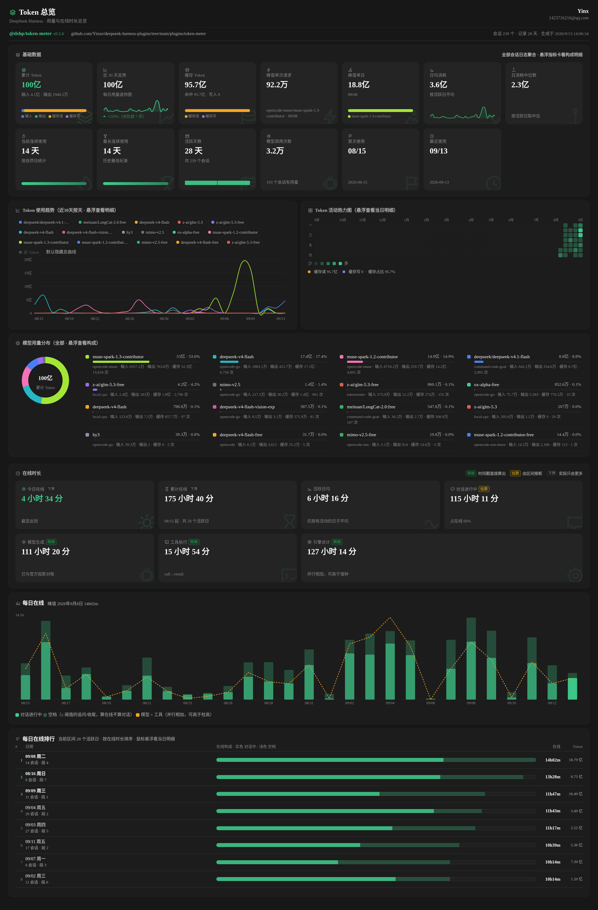
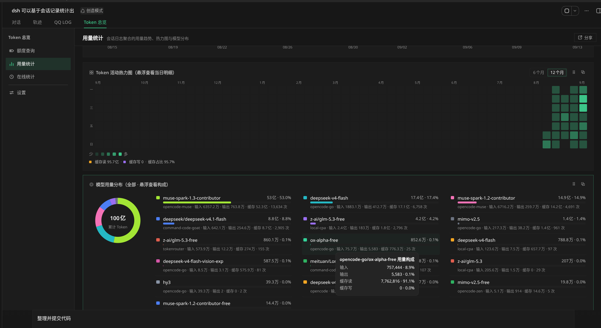
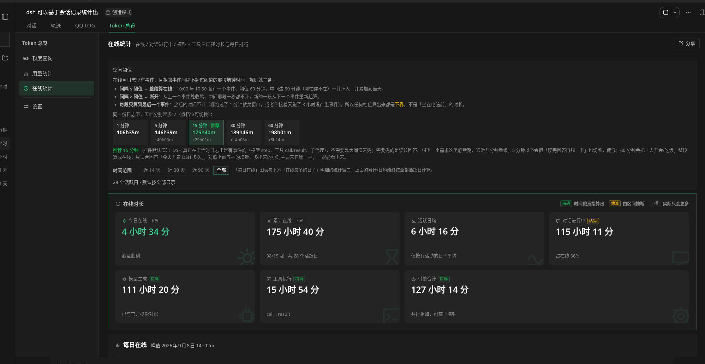
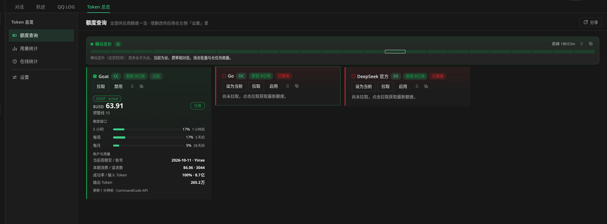

# deepseek-harness-plugins

DeepSeek Harness（DSH）插件 Monorepo（pnpm workspaces + TypeScript ESM）。

> **运行时零依赖 · 构建产物已提交**：所有插件 `dependencies` 恒为 `{}`，`lib/host.js` / `lib/client.js` 随仓库提交 —— clone 下来即可直接安装，无需先 build。

## 插件一览

| 插件                                                                 | 一句话                                                                                                                                                                                                                                                                                                                                                                                                                                                                                                                                    | 文档                                           |
| -------------------------------------------------------------------- | ----------------------------------------------------------------------------------------------------------------------------------------------------------------------------------------------------------------------------------------------------------------------------------------------------------------------------------------------------------------------------------------------------------------------------------------------------------------------------------------------------------------------------------------- | ---------------------------------------------- |
| **[@dshp/token-meter](plugins/token-meter/README.md)**               | Token 额度 + 用量统计 + 在线时长：额度唯一入口是左侧边栏底部按钮（**按钮内容由各供应商模板自由渲染**——环 / 余额 / 多条窗口迷你条 + 供应商图标，**显示什么由该供应商自己的小控件决定**（画在它的详情卡片底部）；点开在按钮上方弹出详情 + 供应商切换；多供应商 opencode / DeepSeek / Command Code / 手动）+ 本机会话日志聚合（趋势 / 热力图 / 模型分布 / 在线时长与每日排行，增量重算、口径分级）；统计图表可弹出为独立小组件（装了 `@dshp/widget-kit` 时是框架卡片，入口在中心区「用量统计」工具条），本插件不占任何活动栏图标             | [README](plugins/token-meter/README.md)        |
| **[@dshp/vision-bridge](plugins/vision-bridge/README.md)**           | 视觉桥接：让纯文本模型也能“看图”（`vision_describe` 工具 + 主/备模型自动降级）                                                                                                                                                                                                                                                                                                                                                                                                                                                            | [README](plugins/vision-bridge/README.md)      |
| **[@dshp/mcwiki-search](plugins/mcwiki-search/README.md)**           | Minecraft Wiki 查询工具（搜索 / 引言 / 全文，含模板清理的 AI 可读转换）                                                                                                                                                                                                                                                                                                                                                                                                                                                                   | [README](plugins/mcwiki-search/README.md)      |
| **[@dshp/search-provider](plugins/search-provider/README.md)**       | `web_search` 供应商中枢：Tavily 等可插拔接入，动态选型                                                                                                                                                                                                                                                                                                                                                                                                                                                                                    | [README](plugins/search-provider/README.md)    |
| **[@dshp/web-style](plugins/web-style/README.md)**                   | Web 外观定制：8 套主题画廊一键切换并持久化 + 3 个可交互背景效果（官网同款点阵字标 / 极光辉光 / 程序化流场，与主题正交）+ 壁纸取色（Material You）+ 全局圆角                                                                                                                                                                                                                                                                                                                                                                               | [README](plugins/web-style/README.md)          |
| **[@dshp/skill-manager](plugins/skill-manager/README.md)**           | 技能管理：设置页统一管理全局（`~/.dsh/skills`、`~/.agents/skills`）与工作区技能——新建/编辑/启停/复制移动/删除                                                                                                                                                                                                                                                                                                                                                                                                                             | [README](plugins/skill-manager/README.md)      |
| **[@dshp/mcp-manager](plugins/mcp-manager/README.md)**               | MCP 服务器管理：设置页管理 cordis.patch.yml 里的官方 dsh-mcp-client 实例——新建/编辑/启停/删除/探活，表单+JSON 双模式，回写保注释                                                                                                                                                                                                                                                                                                                                                                                                          | [README](plugins/mcp-manager/README.md)        |
| **[@dshp/file-change-viewer](plugins/file-change-viewer/README.md)** | 文件修改查看器 + **`patch` 工具**：接管对话流里的 edit / write / patch 行（外壳沿用官方原生行，默认折叠、可在设置里改成默认展开），展开后每个文件块是一张带**语法高亮的统一 diff** 卡片（整行红绿、删除行不占行号、统计只算真正变化的行）；`patch` 工具让「多处零散 / 跨文件」的批量修改一次调用完成且**全有或全无**；全局偏好在设置里自己的一节「File Change View」中配置（展示方式是两张直接画出效果的预览卡），落 settings.yaml；会话页头另有两个**只作用于当前会话**的快捷开关（一键展开 / 收起全部文件改动、切换差异视图），不写配置 | [README](plugins/file-change-viewer/README.md) |
| **[@dshp/widget-kit](plugins/widget-kit/README.md)**                 | 小组件规范与宿主（**不含业务**）：会话顶部托盘（图标/徽标/双向拖拽换序/溢出菜单/启用禁用）+ 可拖拽/缩放/最小化折叠/**锁定位置**/关闭的卡片（拖动自由跟手、允许互相覆盖，靠近边缘/邻卡时给出虚线**吸附预览框**、松手才吸附）与可点击或悬停展开（可声明**常驻**）的小面板，统一负责加载/错误/陈旧态、轮询节流、错误隔离、z 序、几何夹紧、本机布局持久化（刷新即恢复）与键盘焦点；**内容如何随尺寸变化由组件提供方决定**（`sizeClass` / 容器查询 / 实测 `size` 三选一）                                                                      | [README](plugins/widget-kit/README.md)         |

## 截图预览

### `@dshp/token-meter` — 额度 + 用量 + 在线（界面名：**Token 总览**）

**额度**只有左侧边栏底部一枚按钮（`sidebar.footer.action`），**按钮内容由各供应商模板自由渲染**（不限于环）：供应商图标 + 环 / 余额大数字 / `5时·周·月` 三条迷你条都可以，宽栏是「图标 + 主图形 + 名字 + 数值」、56px 窄栏只剩主图形；装得进一枚按钮就行。点开在按钮**上方**弹出浮层 —— 当前供应商的详情（详情模板产出 + 数据新鲜度）+ **它自己画在详情卡片底部的显示控件**（如 Goat 的「数值位显示余额」开关 + `5h / 1w / 1m` 单选，默认月额度；偏好存**浏览器本地**的 `tm-quota-prefs`、不进 `settings.yaml`）+ 「切换供应商」列表（每行左侧的图形同样来自该 provider 的按钮模板，点击即切换，一次只激活一个）。它不占活动栏图标，也不是中心区的一块面板。

**会话中心区**注册一个 tab（`conversation.view`，与原生「对话 / 轨迹」并列），tab 内用**左侧菜单**切换**三块**：

- **用量统计**：基础数据指标卡 + Token 趋势折线 + 活动热力图 + 模型用量分布（圆环 + 多列模型列表，进度条与印出的百分比同口径）+ 每日在线 + 每日在线排行；顶部「小组件」工具条逐张开合那 5 张统计小组件。
- **在线统计**：在线（你 + DSH）/ 对话进行中（DSH 的钟）/ 模型 + 工具（DSH 的活，精确）三口径 + 每日在线柱线图 + 每日排行 + 「口径与准确性」表（精确 / 估算 / 下界 徽标标出每个数字能不能信）。顶部常驻**空闲阈值**说明：三条规则（间隔 ≤ 阈值则整段计入、超过则断开、每段只算到最后一个事件所以是下界）+ 五档实测对比（可点切换，推荐 15 分钟）。
- **设置**：分两个 Tab —— 「统计设置」（数据来源、缓存与扫描状态、**一键清除统计缓存并重算**、默认范围、在线空闲阈值）与「额度配置」（供应商与自动刷新）；与 `设置 → Token 总览` 是**同一个组件**（改一处两边同步）。

> 所有统计都由 `$DSH_HOME/sessions/` 的会话日志重算：**迁移/备份请保留该目录**（派生缓存可丢，会话记录不能丢）。

tab 头部「分享」按钮可把用量统计与在线统计**内聚成一块面板**（真组件原样拼装，非自绘），面板内可滚动查看，并支持下载 PNG / 复制图片或直接系统截图。



| 用量统计                                                | 在线统计                                           | 旧版额度查询（重构前）                                |
| ------------------------------------------------------- | -------------------------------------------------- | ----------------------------------------------------- |
|  |  |  |

> 其余插件暂无界面截图；使用说明与配置见各自的 README（上表「文档」列）。

## 安装到 DSH

### 方式一（推荐）：克隆仓库安装 —— 更新只需 `git pull`，旧版 DSH 可 checkout tag

```bash
git clone git@github.com:Yinxe/deepseek-harness-plugins.git
cd deepseek-harness-plugins
pnpm install
# lib/ 已提交，clone 下来就能用；改了 src 才需要 pnpm build

# 安装你需要的插件（按目录名，可多个）
dsh plugin --profile web add ./plugins/token-meter
dsh plugin --profile web add ./plugins/vision-bridge
dsh plugin --profile web add ./plugins/mcwiki-search
dsh plugin --profile web add ./plugins/search-provider
dsh plugin --profile web add ./plugins/web-style
dsh plugin --profile web add ./plugins/skill-manager
dsh plugin --profile web add ./plugins/mcp-manager
dsh plugin --profile web add ./plugins/file-change-viewer
dsh plugin --profile web add ./plugins/widget-kit

dsh web   # 重启生效
```

- **`@dshp/widget-kit` 是可选的**：装上后，提供小组件的插件（如 `@dshp/token-meter` 的统计图表）自动升级为**框架卡片**——拖拽 / 缩放 / 最小化成胶囊 / 锁定位置 / 吸附预览 / 主题色玻璃外观 / 刷新后原地恢复；不装则退回插件自带的浮层，功能不缺、只是窗口能力弱一档。
- **更新**：仓库内 `git pull` + `dsh web`（最快——lib 已提交，未改 src 无需 build）；兼容旧版 DSH：按 [`compat.json`](compat.json) 的 tag `git checkout <tag>` 后重跑上面的 add。

`dsh plugin add` 会把包写进 profile 的 `dsh.profile.bundles` —— **无需手动改配置文件**。
各插件的详细安装说明、配置与常见问题见对应 README（上表）。

### 方式二：从 Release 安装（无需 clone；更新需手动重跑命令）

CI 把每个插件打包成 tgz 发布到 Releases，`latest` 滚动发布固定跟随 main 最新构建（持 Latest 徽标、始终置顶）：

```bash
# macOS / Linux
dsh --profile web add \
  https://github.com/Yinxe/deepseek-harness-plugins/releases/download/latest/dshp-mcwiki-search-latest.tgz
```

```powershell
# Windows PowerShell
dsh --profile web add `
  'https://github.com/Yinxe/deepseek-harness-plugins/releases/download/latest/dshp-mcwiki-search-latest.tgz'
```

全部插件的下载与安装命令见 [Releases](https://github.com/Yinxe/deepseek-harness-plugins/releases) 各预发布说明；**滚动更新 = 重跑同一条命令 + `dsh web` 重启**（`latest` 资产随 main 每次构建滚动重建）。

> **两个 pnpm 语义坑**，遇到别绕远路：
>
> 1. `dsh plugin … update` 对 tarball URL 直装**无效**——`pnpm update` 只重解析 semver 范围，URL 是精确 spec（且 lockfile 用 integrity 钉住首次内容），永远 "Already up to date"。滚动更新请**重跑同一条 add 命令**（或用下面的 Git tag 安装）；
> 2. `remove` 后重装同一 URL 若报 `ERR_PNPM_MISSING_TARBALL_INTEGRITY`（lockfile 残留了无 integrity 的条目），删掉 profile 目录里的 `pnpm-lock.yaml` 再 add 即可（lockfile 是可再生的本机状态）。

### 历史版本（兼容旧版 DSH）

main 永远跟随最新 DSH。老版本 DSH 用户装**静态历史版本**：按 [`compat.json`](compat.json) 记录的兼容 tag（「DSH 版本 → 推荐 tag」矩阵），到 [Releases](https://github.com/Yinxe/deepseek-harness-plugins/releases) 找对应版本 Release（`v*` tag 触发，静态存档、永不滚动），资产名 = `dshp-<插件名>-<tag>.tgz`：

```bash
# 以 v0.1.5-rc.1 为例
dsh --profile web add \
  https://github.com/Yinxe/deepseek-harness-plugins/releases/download/v0.1.5-rc.1/dshp-mcwiki-search-v0.1.5-rc.1.tgz
```

### 方式三：Git 依赖安装 —— 支持 `update` 一键（可解析较慢，列为备选）

仓库自带一个**随 CI 滚动的 `latest` git tag**（每次 main 构建通过门禁后重置到 main HEAD）。装它 = "永远最新"，且 **`update` 一键跟进**——spec 永不改变，可变性由 git ref 承担，完全绕开 tarball URL 的语义坑：

```bash
# 安装（一次，此后 spec 永不改）
dsh plugin --profile web add \
  "github:Yinxe/deepseek-harness-plugins#latest&path:plugins/<插件名>"

# 之后每次更新就这一条：
dsh plugin --profile web update @dshp/<插件名>
dsh web   # 重启生效
```

**同一机制的两种变体**（换选择器即可）：

- `#semver:^1.0.0&path:plugins/<插件名>` —— 跟发版 tag 走的**受控升级**：只在 push 了匹配范围的新 tag 后 update 才会动；预发布 tag 受 node-semver 元组规则限制，范围必须显式含预发布（如 `^0.1.5-rc.1` 只匹配 0.1.5 系列）；
- `#main&path:plugins/<插件名>` —— 与 `#latest` 等价的分支滚动。

注意：

- `latest` tag 在门禁**通过后**才移动到 main HEAD，所以 update 拿到的永远是过了门禁的构建；
- git 解析在你网络慢时可能要 2–4 分钟；一次 clone 后 pnpm 有本地缓存，重复 update 会快一些；
- **协议取决于你本机的 pnpm 版本，而不是 spec 本身**：pnpm ≥ 11.21.0 的 `github:` 简写走 HTTPS，开箱即用；更早的版本（如 11.7.0）会解析成 `git+ssh://git@github.com/…`，**需先配好 GitHub SSH key**，否则报 `Permission denied (publickey)`。旧版又不想配 key 时，升级 pnpm，或让 Git 把 ssh 重写成 HTTPS（pnpm 只是 shell out 到 `git`，重写自动生效）：

  ```sh
  git config --global url."https://github.com/".insteadOf "git@github.com:"
  ```

- 对比：tarball URL 直装（`…latest.tgz`）的 spec 是精确 URL，`update` 永远 no-op——这正是 git 依赖方案存在的理由。

**多插件统一更新**：`update` 支持一条命令带多个包名（git 与 tarball 混装亦可）：

```bash
dsh plugin --profile web update "@dshp/*"   # 或显式列出：update @dshp/a @dshp/b …
```

实测耗时（国内网络、SSH 热缓存）：**约 35 秒/插件、线性增长**（3 个 ≈ 1 分 40 秒；首次冷安装更久，每个都要完整 clone）。插件多且网络差时更新会到分钟级——这是 git 解析的固有成本，根治要等 npm 发布渠道恢复（registry 元数据 + CDN tarball，秒级）。tarball 渠道的多插件重装同样支持一条命令带多个 URL，但在 HTTPS 不稳的网络下可能超时。

### 卸载

```bash
dsh plugin --profile web remove "@dshp/<插件名>"
dsh web   # 重启生效
```

`remove` 直接转发 pnpm（参数 = 包名），并自动从 `dsh.profile.bundles` 撤下挂载；写入 `settings.yaml` 的配置分节按需手动清理。各插件的详细安装/更新/卸载说明见各自 README。

### 一键 AI 安装

把下面这段发给你的 DSH AI，让它代你装：

```text
帮我从 monorepo Yinxe/deepseek-harness-plugins 安装插件（按需选择子目录）：
1. git clone 仓库并 pnpm install
2. dsh plugin --profile web add ./plugins/<子目录名>
3. 重启 dsh web，确认无报错、设置页出现对应条目
```

### 发布与更新约定（CI 自动执行）

| 通道         | 触发                      | 行为                                                             |
| ------------ | ------------------------- | ---------------------------------------------------------------- |
| `latest`     | 推送 `main`               | 滚动重建到最新提交（正式渠道，持 Latest 徽标置顶），下载地址固定 |
| 版本 Release | 推送 `v*` tag             | 静态存档，永不随构建变化                                         |
| 自定义后缀   | 手动触发（限 main / tag） | 勾选 rolling = 预发布随滚动；不勾 = 静态正式版                   |
| 仅门禁       | 推送其他分支 / PR         | 不打包、不发布（分支上的构建产物没有意义）                       |

- **只有 `main` 与 `v*` tag 能产出发布物**：其他分支推送与 PR 只跑门禁；手动触发是唯一的人工发版口，也只在 `main`（或 `v*` tag）上生效，在别的 ref 上跑只跑门禁并打一条 notice。要给人试新版，用 `main` 的 `latest`，或手动触发指定后缀。
- **滚动约定**：所有**预发布**（以及 notes 首行带 `<!-- rolling: true -->` 标记的 release）都跟随 main——每次 main 推送成功后整体重建到最新提交；停止跟随 = 取消 Pre-release 勾选或删除标记行。`latest` 每次最后重建并授予 Latest 徽标，始终置顶 Releases 列表。
- **数量约束**：除 `latest` 外同时最多允许 **1 个**滚动项；出现多个时 CI 立即报错终止（不动任何现有 Release），处理后再推送即可。
- Release 说明由 `scripts/gen-release-notes.cjs` 生成：逐插件列出包名、版本、双语描述、下载与安装命令。

## 结构

```
.
├── plugins/
│   ├── token-meter/            # @dshp/token-meter（Token 额度 + 用量统计）
│   │   ├── src/host/           #   Host TS：providers/{opencode,deepseek,commandcode,manual} + view/errors + stats/
│   │   ├── src/client/         #   Client TS：providers/{kit,sections,registry,ui/*} + Quota/Stats/TokenMeter Section
│   │   ├── images/             #   界面截图（README「截图预览」用）
│   │   ├── lib/                #   单文件构建产物（已提交，DSH git 安装必需）
│   │   └── cordis.patch.yml    #   bundle 声明（id: dshp-token-meter）
│   ├── vision-bridge/          # @dshp/vision-bridge（视觉桥接）
│   │   ├── src/host/           #   Host TS：types/http/config/cache/vision/index
│   │   ├── src/client/         #   Client TS：types/styles/api/components/VisionSection/index
│   │   └── lib/                #   单文件构建产物（已提交）
│   ├── mcwiki-search/          # @dshp/mcwiki-search（Minecraft Wiki 查询）
│   ├── search-provider/        # @dshp/search-provider（web_search 供应商中枢）
│   ├── skill-manager/          # @dshp/skill-manager（全局 + 工作区技能管理）
│   ├── mcp-manager/            # @dshp/mcp-manager（MCP 服务器管理：patch 条目 CRUD + 探活）
│   ├── file-change-viewer/     # @dshp/file-change-viewer（edit / write 行的高亮差异视图 + 独立设置节）
│   │   ├── src/host/           #   Host TS：settings 命名空间 + /ext 两条配置路由 + patch 工具
│   │   ├── src/shared/         #   unified diff 解析 / 应用（Host 与 Client 共用）
│   │   ├── src/client/         #   Client TS：diff（LCS 三口径）+ FileChangeRow + 设置节 + prefs store
│   │   ├── scripts/            #   check-host.mjs（47）+ check-patch.mjs（41）+ check-client.mjs（143）
│   │   └── lib/                #   单文件构建产物（已提交）
│   ├── widget-kit/             # @dshp/widget-kit（小组件规范与宿主：托盘 + 卡片 + 小面板，不含业务）
│   │   ├── spec.d.ts           #   对外契约（其它插件 import type 的唯一入口）
│   │   ├── src/client/         #   Client TS：spec/geometry/store/service/badges/hooks + Tray/Card/Popover
│   │   ├── src/client/widgets/ #   参考组件：clock（尺寸呈现示例）/ diagnostics（注册表诊断）
│   │   ├── scripts/            #   六个自检（几何 / 存储 / 契约漂移 / 样式与依赖 / 无头冒烟）
│   │   └── lib/                #   单文件构建产物（已提交）
│   └── web-style/              # @dshp/web-style（8 套主题画廊 + 背景效果 + 壁纸取色 + 全局圆角）
│       ├── src/host/           #   Host TS：types/http/config + themes/（token 单源，8 个主题模块）
│       ├── src/client/         #   Client TS：GallerySection/apply-theme/background{,-dots,-aurora,-flow}/md3/official/radius/themes/api/state
│       ├── scripts/            #   check-themes.mjs（目录 ↔ 画廊 meta ↔ 产物一致性）
│       └── lib/                #   单文件构建产物（已提交）
├── AGENT.md                    # 开发规范·规则版（红线 + 指路）
├── docs/                       # 规范细节（脚手架 / TS / package.json / 构建 / Cordis / settings / 路由 / Client / provider / 时区 / 安全 / 门禁 / 发布 / 文档 / 小组件）——旧 AGENT.md §1–§14 的完整下沉
├── tsconfig.base.json          # 共享 TS 配置（NodeNext + strict）
├── tsconfig.json               # solution 引用
├── pnpm-workspace.yaml         # packages: plugins/* + storeDir
├── compat.json                 # DSH 版本兼容矩阵（空 = 暂无历史包袱）
└── .github/workflows/CICD.yml  # 门禁 + 打包发布：main→latest 滚动发布，v* tag→版本 Release，其他分支→同名预发布；dev 与 feature/* 仅门禁
```

每个插件内部一律是同一套布局：`src/host/`（Node 半）+ `src/client/`（浏览器 半）+ `lib/`（已提交的单文件产物）+ `cordis.patch.yml` + `AGENT.md`（本插件的局部规则与事实，指回根规范）。

### 设置键名约定（全仓统一，改名即 breaking）

每个插件只有一个配置键，四处同名，等于 `dshp-<目录名>`：

| 位置                                                           | 值（以 token-meter 为例） |
| -------------------------------------------------------------- | ------------------------- |
| settings.yaml 命名空间（`installSection` / `settings.update`） | `dshp-token-meter`        |
| 同源路由前缀                                                   | `/ext/dshp-token-meter/*` |
| `cordis.patch.yml` 的 `id`                                     | `dshp-token-meter`        |
| 设置页 `settings.section` 的 `id`                              | `dshp-token-meter`        |

**插件只读自己的键，不做任何历史键兼容与迁移**：不读 `dshp-inx-*` 等旧命名空间、不读 `storages/*.json`、不改写 `settings.yaml`（规范见 [docs/settings.md](docs/settings.md)）。升级时若键名有变，请按各插件 README 的更新日志**手工**把旧分节改名或重配；配置键改名属 breaking 变更。

## 环境

- Node >= 20（推荐 24，见 `.nvmrc`）
- pnpm 11.7.0（见 `devEngines`）
- 本沙箱全局 store 只读，`pnpm-workspace.yaml` 已设 `storeDir: /tmp/pnpm-store`（pnpm v11 必须写这里，`.npmrc` 会被忽略）

## 常用命令

```bash
pnpm install
pnpm check         # 一条流程：build → typecheck → lint → format（提交前跑这个）
pnpm format        # prettier 全仓写盘
pnpm format:check  # CI 用，只检查不写
pnpm lint          # oxlint 全仓（--deny-warnings，警告也算挂）
pnpm typecheck     # pnpm -r typecheck
pnpm build         # pnpm -r build
pnpm test          # pnpm -r test

# 单个插件
pnpm --filter @dshp/token-meter build
pnpm --filter @dshp/token-meter typecheck
```

提交前跑 `pnpm check`（构建 → 类型检查 → 质量检查 → 格式化一步完成）；CI 仍按严格检查序把关；改了 `src/` 必须重新 build 并把 `lib/` 一起提交。

## 加新插件

```bash
mkdir -p plugins/<name>/src
# 照抄 plugins/vision-bridge/{package.json,tsconfig.json}，改 name/version/description
# tsconfig.json 里 extends 保持 ../../tsconfig.base.json
# 根 tsconfig.json references 加一条 { "path": "./plugins/<name>" }
pnpm install
```

规范分三层：**[AGENT.md](AGENT.md)**（红线规则版）→ **[docs/](docs/)**（主题细节，旧 §1–§14 全部下沉在此）→ 各插件 `AGENT.md`（局部规则与事实）。多供应商分层渲染、接管工具行渲染等专题见 docs/ 对应篇目。
